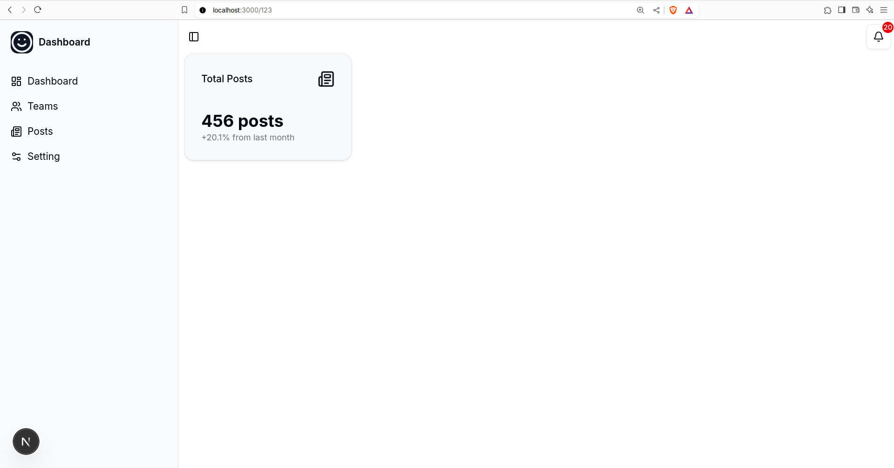

# Admin Dashboard

A admin dashboard built with Next.js, React, and Tailwind CSS.



## Features

- 🚀 Built with Next.js 15.2.4 with Turbopack
- ⚛️ React 19 for the latest React features
- 🎨 Styled with Tailwind CSS 4
- 🧩 Component library built with Radix UI primitives
- 🔍 TypeScript for type safety
- 🖌️ Beautiful UI components with Lucide icons

## Technology Stack

- **Frontend Framework**: Next.js 15.2.4
- **UI Library**: React 19
- **Styling**: Tailwind CSS 4, tailwind-merge, class-variance-authority
- **Icons**: Lucide React
- **UI Components**: Radix UI (Dialog, ScrollArea, Separator, Slot, Tooltip)
- **Animations**: tw-animate-css
- **Development**: TypeScript, ESLint 9
- **Build Tool**: Turbopack

## Getting Started

### Prerequisites

- Node.js 18.x or higher
- npm or bun package manager

### Installation

1. Clone the repository

```bash
https://github.com/kaungminhtet-swe/admin-dashboard.git
cd admin-dashboard
```

2. Install dependencies

```bash
# Using npm
npm install

# Using bun
bun install
```

3. Start the development server

```bash
# Using npm
npm run dev

# Using bun
bun dev
```

4. Open [http://localhost:3000](http://localhost:3000) in your browser

## Available Scripts

- `npm run dev` - Start the development server with Turbopack
- `npm run build` - Build the application for production
- `npm run start` - Start the production server
- `npm run lint` - Run ESLint to check code quality

## Usage

This admin dashboard provides a foundation for building admin interfaces with various components:

- Dashboard overview
- User management
- Analytics and reporting
- Settings and configuration

Customize the components in the `components/ui` directory to match your design requirements.

## Project Structure

```
admin-dashboard/
├── app/               # Next.js app directory
├── components/        # Reusable UI components
│   └── ui/            # Core UI components
├── hooks/             # Custom React hooks
├── lib/               # Utility functions and helpers
├── public/            # Static assets
└── ...
```

## Contributing

Contributions are welcome! Please feel free to submit a Pull Request.

1. Fork the repository
2. Create your feature branch (`git checkout -b feature/amazing-feature`)
3. Commit your changes (`git commit -m 'Add some amazing feature'`)
4. Push to the branch (`git push origin feature/amazing-feature`)
5. Open a Pull Request

## License

This project is licensed under the Apache License 2.0 - see the [LICENSE](LICENSE) file for details.

## Acknowledgements

- [Next.js](https://nextjs.org/)
- [React](https://react.dev/)
- [Tailwind CSS](https://tailwindcss.com/)
- [Lucide Icons](https://lucide.dev/)
- [Radix UI](https://www.radix-ui.com/)
